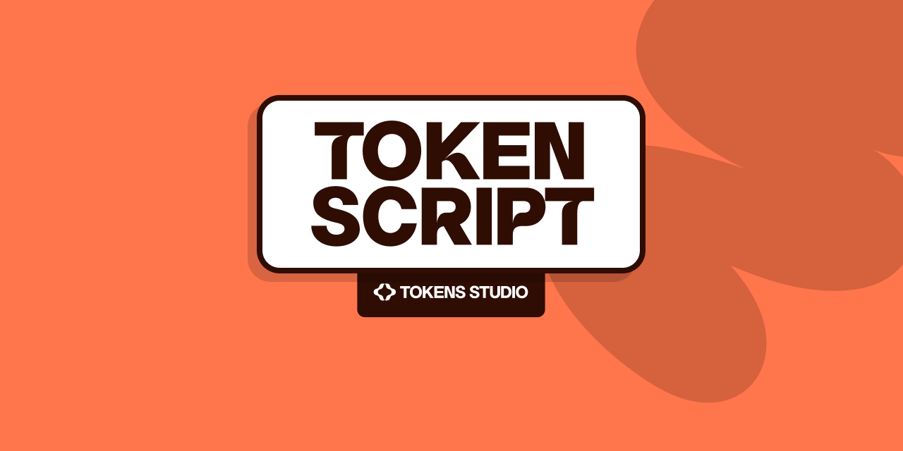

# TokenScript Interpreter

A TypeScript interpreter for **TokenScript**, a domain-specific language designed for design token manipulation, computation, and color space conversions. TokenScript provides a powerful, type-safe environment for working with design tokens in modern design systems.

This is an early public release. The language and interpreter are under active development. You can find the interactive playground [here](https://repl.tokenscript.dev.gcp.tokens.studio/) and our talk about TokenScript at [Penpot Fest 2025](https://www.youtube.com/watch?v=H82szrnX4ws).

Additionally we released the [TokenScript Standard Compliance Test Suite](https://github.com/tokens-studio/tokenscript-compliance-suite) which enables you to validate your TokenScript implementations against the official specification.

If you want join the discussion or have questions, feel free to reach out on our [Tokens Studio Slack](https://tokens-studio.slack.com/archives/C09KPC4MFUL).

## Language Overview

TokenScript is a statically-typed language that excels at design token operations, mathematical computations, and color manipulations. It features:

- **Strong Type System** with design-aware types (Color, NumberWithUnit, etc.)
- **Color Space Management** with dynamic type loading and conversions trees
- **Unit-Aware Arithmetic** for consistent spacing, sizing, and measurement calculations
- **Control Flow** with conditional statements and loops
- **Built-in Functions** optimized for design token operations
- **Optimized Reference Resolution** for token alias and dependency management

## Language Features

### Type System

TokenScript provides several built-in types optimized for design work:

```tokenscript
// Basic Types
variable name: String = "primary-button";
variable count: Number = 42;
variable isVisible: Boolean = true;

// Design-Specific Types
variable spacing: NumberWithUnit = 16px;
variable primaryColor: Color = #ff6b35;
variable tokenList: List = "red", "green", "blue";
```

### Color Management

TokenScript excels at color operations with full color space support:

```tokenscript
variable yellow: Color = #FF9900;
variable prettyRamp: List = oklchRamp(yellow.to.oklch()).values();

variable hexValues: List;
variable colorIndex: Number = 0;
variable currentColor: Color.Oklch;
while (colorIndex < prettyRamp.length()) [
  currentColor = prettyRamp.get(colorIndex);
  hexValues.append(currentColor.to.hex());
  colorIndex = colorIndex + 1;
]

return hexValues;
```

### Mathematical Operations

Built-in support for design-aware mathematics:

```tokenscript
// Unit-Aware Arithmetic
variable baseSpacing: NumberWithUnit = 8px;
variable largeSpacing: NumberWithUnit = baseSpacing * 3; // 24px
variable wildMixing: NumberWithUnit = return 1rem + 1px + 10%; // 18.7px

// Mathematical Functions
variable rounded: Number = round(3.14159, 2); // 3.14
variable maximum: Number = max(10, 20, 30); // 30
variable power: Number = pow(2, 3); // 8
```

### Control Flow

Standard programming constructs for complex logic:

```tokenscript
// Conditional Statements
variable size: String = "medium";
if (size == "small") [
    variable padding: NumberWithUnit = 8px;
] else if (size == "large") [
    variable padding: NumberWithUnit = 24px;
] else [
    variable padding: NumberWithUnit = 16px;
];

// Loops
variable i: Number = 0;
while (i < 5) [
    variable current: NumberWithUnit = baseSpacing * i;
    i = i + 1;
];
```

### Lists and Data Structures

Work with collections of design tokens:

```tokenscript
// List Operations
variable colors: List = "#ff0000", "#00ff00", "#0000ff";
variable firstColor: String = colors.get(0);
variable colorCount: Number = colors.length();

// List Manipulation
colors.push("#ffff00");
colors.update(0, "#ff6b35");
```

### Reference Resolution

TokenScript supports token references for building scalable design systems:

```tokenscript
// References use curly brace syntax
variable primaryColor: Color = {colors_primary};
variable buttonPadding: NumberWithUnit = {spacing_medium} * 2;

// Nested references
variable complexValue: NumberWithUnit = {base_unit} + {modifiers_large};
```

## Configuration Setup

### Basic Configuration

Create a configuration object to customize the interpreter behavior:

```typescript
import { Config, ColorManager, UnitManager, FunctionsManager } from '@tokens-studio/tokenscript-interpreter';

const config = new Config({
  languageOptions: {
    MAX_ITERATIONS: 1000, // Prevent infinite loops
  },
});
```

### Color Specifications

TokenScript uses JSON specifications to define color spaces. Here's how to set up color specifications:

#### 1. Create Color Specification Files

Create JSON files defining your color spaces. Example `rgb.json`:

```json
{
  "name": "RGB",
  "type": "color",
  "description": "RGB color space",
  "schema": {
    "type": "object",
    "properties": {
      "r": { "type": "number" },
      "g": { "type": "number" },
      "b": { "type": "number" }
    },
    "required": ["r", "g", "b"],
    "order": ["r", "g", "b"],
    "additionalProperties": false
  },
  "initializers": [
    {
      "title": "function",
      "keyword": "rgb",
      "description": "Creates RGB color from string",
      "schema": {
        "type": "string",
        "pattern": "^rgb\\((\\d{1,3}),\\s*(\\d{1,3}),\\s*(\\d{1,3})\\)$"
      },
      "script": {
        "type": "https://schema.tokenscript.dev.gcp.tokens.studio/api/v1/core/tokenscript/0/",
        "script": "variable parts: List = {input}; variable output: Color.RGB; output.r = parts.get(0); output.g = parts.get(1); output.b = parts.get(2); return output;"
      }
    }
  ],
  "conversions": [
    {
      "source": "https://schema.tokenscript.dev.gcp.tokens.studio/api/v1/core/hex-color/0/",
      "target": "$self",
      "description": "Converts HEX to RGB",
      "lossless": true,
      "script": {
        "type": "https://schema.tokenscript.dev.gcp.tokens.studio/api/v1/core/tokenscript/0/",
        "script": "// Conversion script here"
      }
    }
  ]
}
```

#### 2. Register Color Specifications

```typescript
import { ColorManager } from '@tokens-studio/tokenscript-interpreter';
import * as fs from 'fs';
import * as path from 'path';

const colorManager = new ColorManager();

// Load and register RGB specification
const rgbSpecPath = path.join(__dirname, 'specifications/rgb.json');
const rgbSpec = JSON.parse(fs.readFileSync(rgbSpecPath, 'utf-8'));
colorManager.register(rgbSpecPath, rgbSpec);

// Register additional color spaces
const hslSpecPath = path.join(__dirname, 'specifications/hsl.json');
const hslSpec = JSON.parse(fs.readFileSync(hslSpecPath, 'utf-8'));
colorManager.register(hslSpecPath, hslSpec);

// Create config with custom color manager
const config = new Config({
  colorManager: colorManager,
});
```

### Custom Function Registration

Extend TokenScript with custom functions:

```typescript
import { FunctionsManager } from '@tokens-studio/tokenscript-interpreter';

const functionsManager = new FunctionsManager();

// Register custom function
functionsManager.registerFunction('customScale', {
  description: 'Scales a value by a custom factor',
  parameters: [
    { name: 'value', type: 'NumberWithUnit' },
    { name: 'factor', type: 'Number' }
  ],
  returnType: 'NumberWithUnit',
  implementation: (value: any, factor: number) => {
    return value * factor;
  }
});

const config = new Config({
  functionsManager: functionsManager,
});
```

### Complete Configuration Example

```typescript
import { 
  Config, 
  ColorManager, 
  UnitManager, 
  FunctionsManager,
  Interpreter,
  Lexer,
  Parser
} from '@tokens-studio/tokenscript-interpreter';
import * as fs from 'fs';
import * as path from 'path';

// Set up color manager with specifications
const colorManager = new ColorManager();
const specsDir = path.join(__dirname, 'color-specifications');
const specFiles = ['rgb.json', 'hsl.json', 'hsla.json'];

specFiles.forEach(filename => {
  const specPath = path.join(specsDir, filename);
  const spec = JSON.parse(fs.readFileSync(specPath, 'utf-8'));
  colorManager.register(specPath, spec);
});

// Configure interpreter
const config = new Config({
  languageOptions: {
    MAX_ITERATIONS: 1000,
  },
  colorManager: colorManager,
  unitManager: new UnitManager(),
  functionsManager: new FunctionsManager(),
});

// Use the configured interpreter
const script = `
  variable primary: Color.RGB;
  primary.r = 255;
  primary.g = 107; 
  primary.b = 53;
  
  variable spacing: NumberWithUnit = 16px;
  variable largeSpacing: NumberWithUnit = spacing * 1.5;
`;

const lexer = new Lexer(script);
const parser = new Parser(lexer);
const interpreter = new Interpreter(parser, { references: {} }, config);

const result = interpreter.interpret();
```

## Installation

```bash
npm install @tokens-studio/tokenscript-interpreter
```

## Usage

### As a Library

```typescript
import { interpretTokens } from '@tokens-studio/tokenscript-interpreter';

const tokens = {
  "primary-color": {
    "value": "#ff6b35",
    "type": "color"
  },
  "large-spacing": {
    "value": "{base-spacing} * 2",
    "type": "dimension"
  }
};

const result = interpretTokens(tokens);
console.log(result);
```

### Command Line Interface

```bash
# Interactive REPL mode
npx tokenscript interactive

# Process tokenset from file
npx tokenscript parse_tokenset --tokenset ./tokens.zip --output ./processed.json

# Run compliance tests
npx tokenscript evaluate_standard_compliance --test-dir ./tests/ --output ./report.json
```
