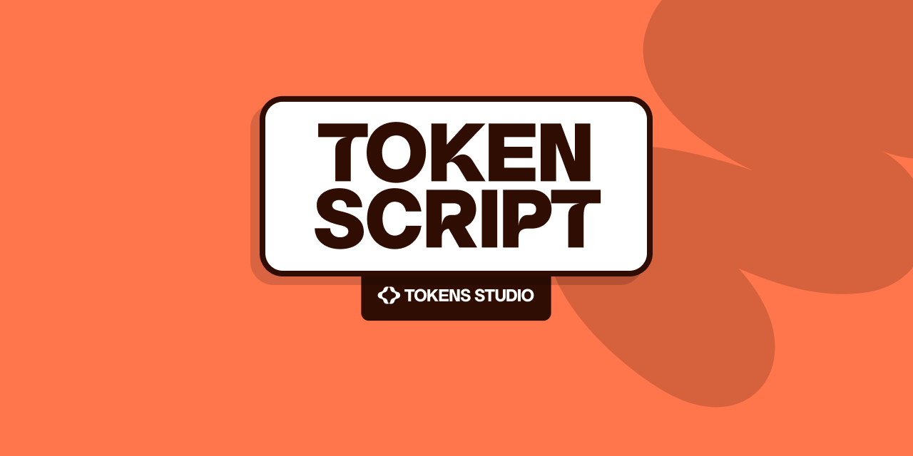

# Tokenscript

**Tokenscript** is a dsl that interprets design tokens. 

With Tokenscript you can write custom functions and ship logic directly with your design tokens.

*This is an early public release. This project is under active development.* 

## Links

- [Documentation][docs]
- [Interactive playground][playground]
- [Community slack][slack]

## Talks

- [Talk about tokenscript at Penpot Fest 2025](https://youtu.be/H82szrnX4ws?t=3938)

## About the language

### Why a Custom DSL?

Tokenscript is a domain-specific language with a compliance library because it provides a small subset of common language features, enabling fast and secure implementation without the complexity of thousands of custom transform functions with different color types. 

The result is a powerful, type-safe environment that extends your design system capabilities.

### Key Features

- **Custom Types and Units**: Define and support custom types and units without relying on platform support
- **Token Computation**: Perform complex calculations and transformations on your design tokens
- **Schemas**: Combine custom functions as schemas to ship logic alongside your token data

### Target Audience

Tokenscript is designed for **tool builders** and **developers who want to extend the language**. While Tokenscript itself is not a tool to transform tokens, complementary tools can interpret and permutate token data using the language.

## Quick guide

### Installation

```
npm i --save @tokens-studio/tokenscript-interpreter
```

### Interpretation

Tokenscript enables tool builders to work efficiently with design token data. 

The fastest way to get started is by using the `interpretTokens` function with your token json data:

``` typescript
import { interpretTokens } from "@tokens-studio/tokenscript-interpreter";

const tokens = {
  "primary-color": {
    "$value": "#ff6b35",
    "$type": "color"
  },
};

const result = interpretTokens(tokens);
// => {"primary-color": "#ff6b35"}
```

### Permutation with Schemas

```typescript
import { interpretTokens } from "@tokens-studio/tokenscript-interpreter";

const tokens = {
  "primary-color": {
    "$value": "#ff6b35",
    "$type": "color"
  },
  "secondary-color": {
    "$value": "{primary-color}",
    "$type": "color"
  }
};

const result = interpretTokens(tokens);
// => {"primary-color": "#ff6b35"
//     "secondary-color": "#ff6b35"}
```

Your desired token features are not tied to any specification or library — enable features by loading the schemas you need.

### Type-Safe AST Parsing

Tokenscript provides comprehensive type guards for working with Abstract Syntax Tree (AST) nodes. This enables you to perform custom functionality on specific parser result types with full TypeScript type safety.

```typescript
import { 
  parseExpression, 
  isNumNode, 
  isBinOpNode,
  type ASTNode 
} from "@tokens-studio/tokenscript-interpreter";

// Parse an expression
const { ast } = parseExpression("42 + 10");

// Use type guards for type-safe node handling
if (ast && isBinOpNode(ast)) {
  console.log(`Operation: ${ast.op}`);
  
  if (isNumNode(ast.left) && isNumNode(ast.right)) {
    console.log(`${ast.left.value} ${ast.op} ${ast.right.value}`);
  }
}
```

For more information, see the [Type Guards documentation](./docs/type-guards.md).

[docs]: https://docs.tokenscript.dev.gcp.tokens.studio/
[playground]: https://repl.tokenscript.dev.gcp.tokens.studio/
[slack]: https://tokens-studio.slack.com/archives/C09KPC4MFUL
